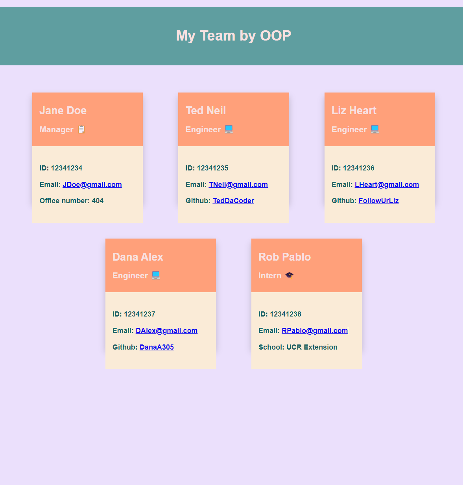

Employee Generator

Description
---
Follow the command line prompt in order to generate employee based cards on a html page.

Table of Contents
---
- [Description](#description)
- [Installation](#installation)
- [License](#license)
- [Contribution](#contribution)
- [Questions](#questions)

Installation
---
Clone repository. Run Node.js. Run 'npm init'.  Install Jest. Run 'npm test'.  Install inquirer. Run app.js: `node app.js`.

License
---
[MIT License](https://opensource.org/licenses/MIT)

Contribution
---
100% open to suggestions.

Questions
---

- Github username- SalvadorBanuelos424
- Email- Salvador.Banuelos.424@gmail.com<a href='Salvador.Banuelos.424@gmail.com'>
